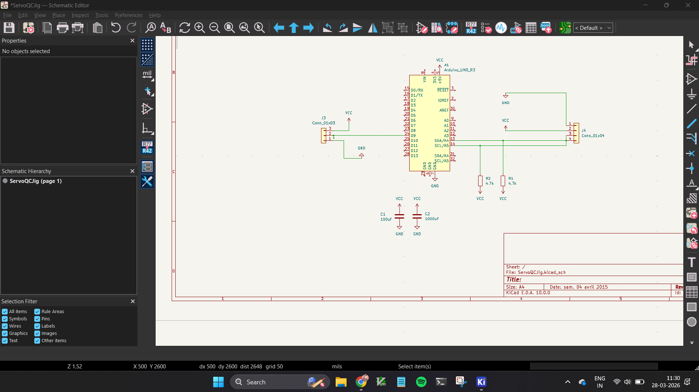

# Servo Motor QC Jig & Reliability Simulator
### Systems Engineering Internship Assignment — POSHA Food Robot

---

## Folder Structure
```
├── task1_servo_qc/
│   ├── task1_servo_qc.ino      
│   ├── diagram.json            
│   └── libraries.txt          
├── task2_failure_modes/
│   ├── task2_failure_modes.ino 
│   ├── diagram.json           
│   └── libraries.txt
├── kicad/
│   └── ServoQCJig_schematic.png
└── README.md
```

---

## Task 1 — Servo Motor QC Jig

### What it does
A software simulation of a physical QC testing jig for a digital servo motor used in the POSHA food preparation robot. Tests every key performance parameter before the servo is deployed.

### Parameters Tested
| Test | Method | Pass Condition |
|------|--------|---------------|
| Position Accuracy (0°, 45°, 90°, 135°, 180°) | Simulated AS5600 encoder | Error ≤ ±5° |
| Repeatability (10 reps at 90°) | StdDev calculation | StdDev < 2° |
| Speed | 180° sweep timing | < 600ms |
| Current Draw | Simulated INA219 | 130–170 mA |
| Voltage | Simulated INA219 | ~5V ± 0.1V |

### Hardware (Physical Implementation)
- **MCU:** Arduino Uno
- **Position Sensor:** AS5600 magnetic rotary encoder (I²C)
- **Power Sensor:** INA219 current/voltage sensor (I²C)
- **Display:** SSD1306 OLED 128×64
- **Simulated in code** for Wokwi demo

### Sample Output
```
  SERVO MOTOR QC TEST JIG  
TEST: 90 deg | Measured: 89.80 deg | Error: 0.20 deg | RESULT: PASS
REPEATABILITY: StdDev 1.18 deg — PASS
SPEED: 180 deg in 500ms — PASS
   ALL TESTS COMPLETE
```

---

## Task 2 — Servo Reliability & Failure Mode Simulator

### What it does
Simulates 5 real-world servo failure modes with causes, effects, and fixes printed to Serial Monitor.

### Failure Modes Demonstrated
| Demo | Failure | Cause | Fix |
|------|---------|-------|-----|
| 1 | Normal Operation | — | Baseline reference |
| 2 | Signal Jitter | Noisy PWM line | 100Ω resistor + shielded cable |
| 3 | Voltage Brownout | Undersized PSU | 1000µF cap + 18AWG wire |
| 4 | Stall + Watchdog | Mechanical blockage | Current watchdog → neutral |
| 5 | Thermal Overload | Continuous stall load | Duty cycle limit + heatsink |

---

## PCB Schematic (KiCad)
Designed in KiCad 8. Shows:
- Arduino Uno as main controller
- 3-pin servo connector with D9 signal, VCC, GND
- 4-pin OLED connector (SDA/A4, SCL/A5)
- 4.7kΩ I²C pull-up resistors on SDA and SCL
- 100nF + 1000µF decoupling capacitors on power rail



### Sample Output
```
 SERVO FAILURE MODE SIMULATOR

(1)Normal Operation
Pulse: 1502us - Voltage: 4.99V - STATUS: OK
Pulse: 1498us - Voltage: 5.08V - STATUS: OK
Pulse: 1495us - Voltage: 5.02V - STATUS: OK
Pulse: 1499us - Voltage: 5.08V - STATUS: OK

(2) Noisy Signal Line — Servo Jitters
CAUSE: Long unshielded wire near power cables
FIX: 100ohm series resistor + shielded cable
Corrupted Pulse: 1463us - STATUS: JITTER FAULT
Corrupted Pulse: 1489us - STATUS: JITTER FAULT
Corrupted Pulse: 1500us - STATUS: JITTER FAULT
Corrupted Pulse: 1385us - STATUS: JITTER FAULT
Corrupted Pulse: 1392us - STATUS: JITTER FAULT
Corrupted Pulse: 1382us - STATUS: JITTER FAULT

(3) Voltage Brownout Under Load
CAUSE: Undersized supply, thin wires
FIX: 1000uF capacitor on power rail, 18AWG wire
Voltage: 4.37V WARNING: BROWNOUT — servo may reset!
Voltage: 4.33V WARNING: BROWNOUT — servo may reset!
Voltage: 4.17V WARNING: BROWNOUT — servo may reset!
Voltage: 4.29V WARNING: BROWNOUT — servo may reset!
Voltage: 4.20V WARNING: BROWNOUT — servo may reset!

(4) Stall Detection & Watchdog Recovery
CAUSE: Mechanical blockage or overload
FIX: Current watchdog returns servo to safe position
Current: 150.00mA Normal
Current: 400.00mA Normal
Current: 900.00mA Normal
Current: 1500.00mA Normal
Current: 1850.00mA STALL DETECTED — returning to neutral!

(5) Thermal Overload Simulation
CAUSE: Running near stall torque continuously
FIX: Duty cycle limit, higher-rated servo, heatsink
Body Temp: 31C OK
Body Temp: 38C OK
Body Temp: 46C OK
Body Temp: 54C WARNING: High temperature
Body Temp: 60C WARNING: High temperature
Body Temp: 64C WARNING: High temperature

CYCLE COMPLETE — restarting in 5s
```
